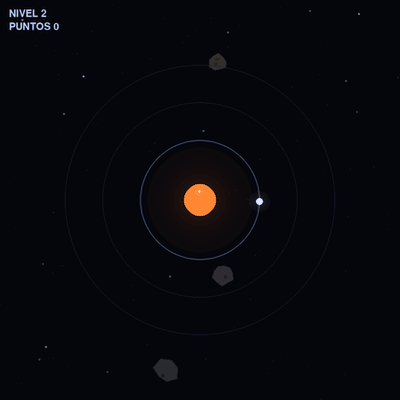

# Kepler's Wake

> Un arcade minimalista de neón sobre **encuentros orbitales**. Saltas entre tres órbitas que giran a distinta velocidad para interceptar fotones antes de que se desvanezcan, mientras esquivas meteoritos. Todo con **un solo botón**.

`Python` · `Pygame` · **sin assets externos** (todo es procedural) · un único archivo



---

## Índice

- [¿Qué es esto?](#qué-es-esto)
- [El truco: física real, pero por diversión](#el-truco-física-real-pero-por-diversión)
- [Cómo se juega](#cómo-se-juega)
- [Cómo se construyó: bitácora de iteración asistida por IA](#cómo-se-construyó-bitácora-de-iteración-asistida-por-ia)
- [Arquitectura del código](#arquitectura-del-código)
- [Cómo ejecutarlo](#cómo-ejecutarlo)
- [Decisiones de diseño que vale la pena recordar](#decisiones-de-diseño-que-vale-la-pena-recordar)
- [Créditos y proceso](#créditos-y-proceso)

---

## ¿Qué es esto?

Kepler's Wake es un mini-juego arcade donde controlas una partícula blanca que orbita un sol. Hay **tres anillos** concéntricos. Del sol emergen **fotones** (rombos ámbar) que se asientan en algún anillo y orbitan; tu trabajo es recogerlos para sumar puntos y subir de nivel, mientras esquivas los **meteoritos** que cruzan la pantalla.

La gracia está en que **no puedes moverte libremente**: solo orbitas el anillo en el que estás, y solo decides **a qué anillo saltar y cuándo**. Esa única decisión es todo el juego.

El nombre de trabajo durante el desarrollo fue *"Neon Drift"* (por eso el archivo se llama `neon_drift.py`), pero el nombre final es **Kepler's Wake**.

---

## El truco: física real, pero por diversión

La idea central no es estética, es mecánica. Los tres anillos giran a velocidades distintas siguiendo la **tercera ley de Kepler**: cuanto más lejos del sol, más lento se completa la órbita.

Todo se deriva de **una sola constante** `GM`:

```
ω(r) = √( GM / r³ )
```

Con los radios actuales (120, 195 y 270 px) y `GM = 1900`, los periodos de órbita son aproximadamente:

| Anillo | Radio | Vuelta completa |
|:------:|:-----:|:---------------:|
| Interno | 120 px | ~3.2 s |
| Medio | 195 px | ~6.5 s |
| Externo | 270 px | ~10.7 s |

¿Por qué importa esto para jugar? Porque **un fotón orbita a la velocidad de Kepler de su propio anillo**. Si estás en el *mismo* anillo que el fotón, vas exactamente a su misma velocidad y **nunca lo alcanzas**. Para atraparlo tienes que estar en *otro* anillo, dejar que la diferencia de velocidad cierre el ángulo entre ambos, y saltar/cruzar justo cuando se alinean. Eso es, literalmente, un **rendezvous orbital** (lo mismo que hace una nave para acoplarse a una estación), convertido en un puzzle de tiempo.

Esa sola regla transforma "camina hasta el punto" en "calcula el encuentro". Es el corazón del juego.

---

## Cómo se juega

**Un solo botón: la barra espaciadora.**

- **Toque corto** → saltas al **anillo siguiente** hacia afuera (y del externo vuelves al interno).
- **Mantener** → un resaltado recorre los otros anillos; **sueltas** para saltar al que esté marcado (te deja elegir el lejano de un solo gesto).
- Durante el salto eres **vulnerable**: cruzas los carriles de los meteoritos, no es un teletransporte seguro.

**Objetivo y progresión:**

- Cada **rombo ámbar** que recoges es **1 punto**.
- Cada **5 rombos** subes de **nivel**, y subir de nivel **te cura +1 vida** (máximo 3). Así una sola acción —recoger rombos— te da puntos, progreso *y* salud.
- Tienes **3 vidas**. Tu color vira de blanco a rojo conforme pierdes vida (sin barra: el color *es* el indicador). Tras cada golpe hay una breve invulnerabilidad para que no te maten varios meteoritos a la vez.
- Los fotones **expiran**: cuando están por desaparecer, parpadean (se desvanecen por completo y reaparecen) durante ~1.5 s para avisarte.

**Arranque suave:** al empezar una partida no aparece ningún meteorito y solo hay **un fotón que no expira**. En cuanto lo recoges, arranca el juego real: aparecen más fotones y comienzan los meteoritos. Así tienes tiempo de entender cómo funciona el espacio antes de que empiece la presión.

---

## Cómo se construyó: bitácora de iteración asistida por IA

Este proyecto nació de una **lluvia de ideas con Gemini**, de donde salió el concepto base (con el nombre placeholder *Neon Drift*). A partir de ahí, el juego se **desarrolló íntegramente con Claude**, en una serie de iteraciones cortas: en cada etapa se le pedía un cambio acotado, se discutían las opciones y sus tradeoffs, se escribía el código, y se **verificaba sin interfaz** (Pygame en modo headless con tests) además de generar **GIFs de previsualización** para revisar el resultado visual antes de continuar.

Lo interesante no fue solo *qué* se construyó, sino *por qué* fue cambiando. Esta es la evolución:

### 1. Esqueleto: ventana y órbita base
Se le pidió a la IA arrancar con lo mínimo: una ventana, un sol al centro y una partícula orbitando, con un bucle de juego limpio y un sistema de "glow" reutilizable para el look de neón. La base sobre la que se construyó todo lo demás.

### 2. Persistencia robusta
Se pidió guardar el progreso de forma confiable. El resultado fue un gestor de guardado con **escrituras atómicas** (archivo temporal + reemplazo) y **recuperación ante corrupción** (si el `save.json` se daña, se respalda y se reinicia con valores por defecto), pensado para no perder datos nunca.

### 3. Vida y textura visual
Se pidió que el sol "se sintiera vivo" y que la partícula dejara rastro. Salió un sol que **pulsa** y con manchas solares proyectadas en 3D (que se deforman y desaparecen al borde, como una esfera real girando), más una estela del jugador. Pura cosmética, pero vende la atmósfera.

### 4. Amenaza: meteoritos, colisión y muerte
Se pidió introducir el peligro. Aparecieron meteoritos en llamas que cruzan apuntando a la zona de juego, la colisión que reinicia la partida, una secuencia de muerte (la partícula explota en partículas geométricas con el tiempo congelado) y una pantalla de **Fin del Juego** con botones.

### 5. El giro clave: de "simulador de caminar" a juego de verdad
Aquí estuvo la decisión más importante. Con una sola órbita, **cualquier punto en tu anillo era gratis**: no había juego, solo esperar. Se le pidió a la IA repensar la mecánica de raíz, y de ahí salió el concepto que define todo:

- **Múltiples órbitas con física de Kepler** (la velocidad de cada anillo derivada de una sola constante).
- **Un solo botón** para seleccionar anillo y saltar (eliminando controles redundantes).
- **Fotones que orbitan a la velocidad de su anillo**, obligando al *rendezvous*: ya no basta con estar en el anillo correcto, hay que cronometrar el encuentro.
- **Progresión por fotones**, no por tiempo, para eliminar el estado de "no hago nada y igual avanzo".

Este fue el momento en que el proyecto dejó de ser una demo bonita y se convirtió en un juego con una decisión interesante en cada segundo.

### 6. Que se sienta justo (y accesible)
Tras probarlo, se pidió pulir la jugabilidad y la legibilidad. Varios cambios concretos, cada uno por una razón:

- **Zona de atracción invisible**: caer "casi encima" de un fotón y no recogerlo se sentía injusto (en el mismo anillo no puedes cerrar un hueco residual porque van a la misma velocidad). Se añadió una zona invisible que atrae el fotón hacia ti en los últimos píxeles —sin anunciarla, porque es lo que el jugador *espera* que pase— sin romper el rendezvous.
- **Control toque/mantener**: el "solo mantener" se sentía muerto al tocar. Se hizo que un toque salte al contiguo y mantener permita elegir.
- **Accesibilidad de color**: el fotón cian y el jugador blanco se confundían (sobre todo con daltonismo). Se separaron por **forma y color**: el jugador es un círculo blanco; el fotón, un **rombo ámbar** (el eje azul–amarillo es el más legible). Se distinguen por silueta, no por tono.
- **Fondo "espacial"**: campo de estrellas + asteroides apagados que derivan lentísimo, para que de verdad parezca el espacio sin saturar.
- **Feedback de expiración y de recogida**: los fotones se desvanecen y reaparecen antes de morir; el jugador destella al recoger.
- **Rebalance de meteoritos**: se volvían imposibles. Se puso un **techo de velocidad** (nunca imposibles de esquivar), una curva más suave en niveles bajos, y se hizo que la dificultad tardía venga de la **densidad**, no de velocidades absurdas. Se negó deliberadamente la "telegrafía" de spawns: con muchos meteoritos a la vez, avisar de todos equivale a no avisar de ninguno.
- **Vidas por color**: en lugar de morir de un golpe, ahora aguantas 3, y la vida se comunica por el color del jugador (blanco → rojo), no por una barra.

### 7. Presentación y onboarding
Finalmente se le pidió "envolver" el juego para alguien que lo abre por primera vez:

- **Menú principal** con el título, "Empezar Partida" (siempre desde cero, conservando el récord) y "Salir".
- **Fondo del menú** con más asteroides y meteoritos lejanos, todo tras un **desenfoque ligero** (logrado sin librerías extra, escalando hacia abajo y de vuelta).
- **Tutorial visual de 3 pasos** que explica casi sin texto: *recoge rombos*, *junta 5 y subes de nivel (y curas)*, *esquiva los meteoritos* (con un meteorito dibujado con su cola). Incluye un checkbox de "no volver a mostrar" que se guarda en el `save.json`.
- **Arranque suave** (sin meteoritos y un fotón eterno hasta el primer toque), nacido de notar que un jugador nuevo no tenía tiempo de entender nada antes de morir.


Un detalle de método: cada GIF que ves en este README se generó de forma reproducible con el propio motor del juego (Pygame headless + Pillow), y para las capturas de jugabilidad se usó un pequeño "piloto automático" que ejecuta encuentros reales, de modo que lo que se muestra es la mecánica genuina y no una animación falsa.

---

## Arquitectura del código

Todo vive en un solo archivo, `neon_drift.py`, con clases de responsabilidad clara y código modular:

| Componente | Rol |
|---|---|
| `SaveManager` | Persistencia con escritura atómica, saneo de tipos y recuperación ante corrupción. |
| `Starfield` / `DecoAsteroid` | Fondo espacial: estrellas, asteroides decorativos a la deriva y meteoritos lejanos del menú. |
| `Sun` | El sol pulsante con manchas solares proyectadas en 3D. |
| `Photon` / `PhotonField` | Ciclo del fotón (emerge → orbita en Kepler → atracción/recogida → expira), arranque suave y atracción invisible. |
| `Meteor` / `MeteorSpawner` | Meteoritos en llamas, curva de dificultad con techo de velocidad y densidad gradual. |
| `Particle` | Partículas geométricas para la muerte y los "pops" de recogida. |
| `Player` | Órbita de Kepler, control de un botón (toque/mantener), salto con tween, vida y feedback. |
| `Button` | Botones de UI reutilizables con estado hover. |
| `Game` | Bucle principal y máquina de estados: `menu`, `tutorial`, `playing`, `dying`, `gameover`. |

Algunas constantes clave están todas juntas arriba del archivo para ajustar el *feel* en una línea: `GM`, `ORBIT_RADII`, `SELECT_STEP_FRAMES`, `PHOTON_ATTRACT`, `PHOTON_LIFETIME`, `METEOR_SPEED_CAP`, `PLAYER_MAX_HP`, etc.

**Sin assets externos:** no hay imágenes ni audio. Todo —sol, partículas, fotones, meteoritos, fondo, texto con glow— se dibuja proceduralmente con primitivas de Pygame.

---

## Cómo ejecutarlo

Requisitos: Python 3.10+ y Pygame.

```bash
pip install pygame
python neon_drift.py
```

El juego crea un `save.json` junto al script para guardar nivel, puntaje, mejor puntaje y si ya viste el tutorial. Si lo borras, simplemente empieza limpio.

**Controles:** barra espaciadora (toque = anillo siguiente, mantener = elegir anillo) · `ESC` vuelve al menú · clic en los botones del menú y del game over.

---

## Decisiones de diseño que vale la pena recordar

- **Una constante manda sobre toda la física.** `GM` define la velocidad de los tres anillos a la vez. Suavizar el exponente o subirla cambia el *feel* completo sin tocar nada más.
- **El rombo es el centro de todo.** Es el punto, el progreso de nivel y (vía subir de nivel) la cura. Unificar su significado hace que el juego se explique casi solo.
- **La física crea la mecánica, no al revés.** El rendezvous no es una regla inventada: cae naturalmente de que cada anillo gire a su velocidad de Kepler.
- **El feedback va por forma y color, no por texto.** Vidas por color, puntos por rombos, expiración por desvanecimiento. Lo mínimo de letras posible.
- **Lo injusto se perdona en silencio.** La zona de atracción es invisible a propósito: corrige el "casi" sin que el jugador tenga que pensarlo.

---

## Créditos y proceso

- **Lluvia de ideas inicial:** Gemini (de ahí salió el concepto base, con el nombre placeholder *Neon Drift*).
- **Desarrollo del juego:** Claude, en iteraciones cortas con verificación headless y previsualizaciones en GIF en cada paso.
- **Motor:** Python + Pygame, 100% procedural.

Este repositorio es, además de un juego, un pequeño registro de cómo una idea de arcade puede madurar a través de iteración asistida por IA: empezando por una demo bonita pero vacía, diagnosticando *por qué* no era divertida, y reconstruyendo la mecánica alrededor de una sola idea fuerte —el encuentro orbital— hasta convertirla en algo que se juega y se entiende.
